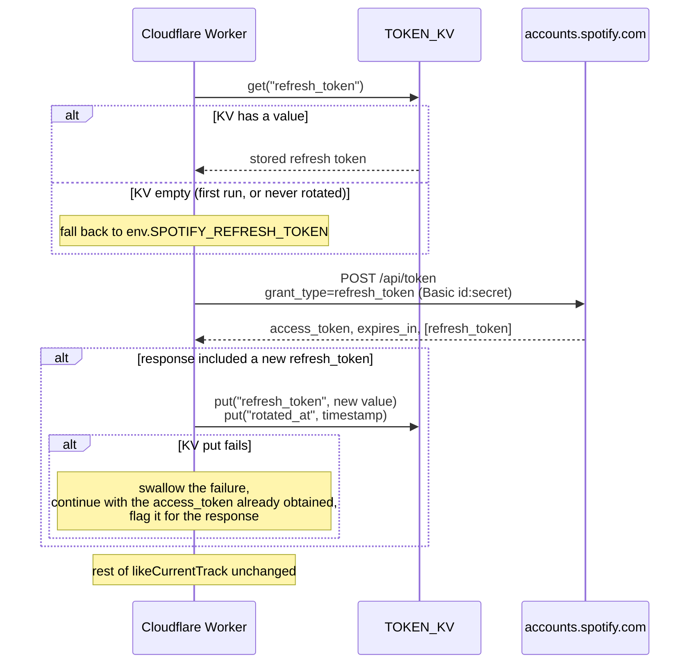

# Design Document

## Overview

This feature adds a persistence layer under the existing `getAccessToken` token exchange so a Spotify-issued replacement `refresh_token` survives across invocations instead of being discarded. It changes exactly one thing about the base feature's runtime behavior: which `refresh_token` value is sent on the OAuth refresh-token grant. Everything downstream — playback read, library write, outcome classification, response shaping — is untouched.

A Cloudflare Workers KV namespace (`TOKEN_KV`) becomes the source of truth for the "current" Refresh_Token once one has been rotated; the Worker Secret `SPOTIFY_REFRESH_TOKEN` remains the bootstrap value used until the first rotation, and is never overwritten. This keeps the base feature's one-time setup procedure valid unchanged: a fresh deploy with no KV entry behaves exactly as it does today.

Two design constraints carry over unchanged from the base feature and shape this one:

1. **The Worker is still stateless per request, but now has one piece of durable state.** KV is the only place this feature writes; there is still no database, no session, no per-user record. The Worker's control flow gains one read and one best-effort write around the existing token exchange, nothing else.
2. **A storage hiccup must never cost the user a like they pressed the button for.** The KV write happens after the Spotify calls that matter have already succeeded or are already underway; a failed KV write degrades to "the same as before this feature existed" (next request falls back to whatever Refresh_Token was already in KV or Secrets), not to a failed request.

## Architecture



### Trust and failure boundaries (additions to the base feature's table)

| Boundary | Trusted? | Consequence for the design |
|---|---|---|
| Worker → Token_Store (KV) | Trusted binding, unreliable storage op | Read failure and write failure are both treated as "KV has nothing useful right now"; neither can fail the request |
| Token_Store → Worker | Trusted (only this Worker writes to it) | KV read result is used directly as a credential value, same trust level as `env.SPOTIFY_REFRESH_TOKEN` |

### Why the KV write happens where it does, not earlier or later

The natural point to persist a Rotated_Refresh_Token is immediately after the token-exchange response is parsed in `getAccessToken`, before that function returns. Two alternatives were rejected:

- **Writing at the end of `likeCurrentTrack`, after the library write succeeds:** would skip persistence whenever the request ends early (nothing playing, not addable, or a data-call failure) even though the token exchange itself succeeded and a new refresh token is sitting right there unused. Every such request would silently forfeit a rotation opportunity, which for a low-frequency button meaningfully raises the odds of ever going stale.
- **Writing asynchronously via `ctx.waitUntil` after responding:** considered, since the persistence is not on the critical path for the user-visible outcome. Rejected because Requirement 3.3 (warn the user in the same response when persistence fails) needs the write's result before the response is built; deferring the write past the response would make that warning impossible without a second round trip. The write is one KV `put`, already off the Spotify-call critical path — its added latency is small next to the two-to-three sequential Spotify calls already in the request — so keeping it synchronous and awaited is simpler and satisfies the requirement directly.

## Components and Interfaces

Extends the base feature's module map:

```
src/
  spotify/
    token.ts       # CHANGED: reads Effective_Refresh_Token from KV-with-fallback,
                    #          persists a Rotated_Refresh_Token + Rotation_Timestamp
  like.ts           # CHANGED: threads a rotation-failure flag from getAccessToken
                     #          through to the outcome
  types.ts          # CHANGED: Env gains TOKEN_KV; Outcome's "added" case gains
                     #          an optional rotation-warning flag
  messages.ts        # CHANGED: adds the warning-suffix formatter
  index.ts           # unchanged — still just routes, gates, calls likeCurrentTrack, responds
```

No new top-level module is introduced. The rotation logic is small enough, and tied tightly enough to the existing token cache, that a separate `src/spotify/token-store.ts` would only add an indirection with a single caller. `token.ts` keeps ownership of "how do I get a valid Access_Token", which now includes "using which Refresh_Token".

### `src/types.ts` — additions

```ts
interface Env {
  SPOTIFY_CLIENT_ID: string;      // wrangler secret
  SPOTIFY_CLIENT_SECRET: string;  // wrangler secret
  SPOTIFY_REFRESH_TOKEN: string;  // wrangler secret — bootstrap value, never overwritten
  SHORTCUT_SECRET: string;        // wrangler secret
  TOKEN_KV: KVNamespace;           // NEW — Token_Store binding
}
```

`Outcome`'s `added` case gains one field so the rotation-failure warning can ride along without inventing a new outcome kind (Requirement 4 forbids a distinct outcome for token problems, and this isn't even a token-exchange failure — it's a bookkeeping failure alongside a successful add, so it does not belong in `Failure`/`classify()` at all):

```ts
type Outcome =
  | { kind: "added"; track: TrackInfo; rotationFailed?: boolean }
  | { kind: "nothing_playing" }
  | { kind: "not_addable" }
  | { kind: "auth_failed" }
  | { kind: "api_failed" }
  | { kind: "network_failed" }
  | { kind: "misconfigured" }
  | { kind: "unauthorized" }
  | { kind: "not_found" }
  | { kind: "method_not_allowed" };
```

`rotationFailed` is optional and defaults to absent/false everywhere except the one call site that can set it. This keeps every existing `{kind: "added", track}` literal in the current codebase and tests valid without modification.

### `src/spotify/token.ts` — changed

Two responsibilities are added to the existing in-isolate cache: reading the Effective_Refresh_Token, and persisting a rotation. Both are private to this module; `getAccessToken`'s signature and return type (`Result<string, Failure>`) do not change, which keeps every existing caller (`like.ts`) source-compatible. What changes is how the caller learns whether a rotation attempt failed: `getAccessToken` is extended to also report that, via a second, additive return channel rather than by overloading `Failure` (a rotation failure is not a reason the Access_Token is unusable — the exchange already succeeded).

```ts
const TOKEN_KV_KEY = "refresh_token";
const ROTATED_AT_KV_KEY = "rotated_at";

interface TokenExchangeResult {
  token: string;
  /** True only if this call obtained a new refresh_token and failed to persist it. */
  rotationFailed: boolean;
}

export async function getAccessToken(env: Env): Promise<Result<TokenExchangeResult, Failure>> {
  if (cached && Date.now() < cached.expiresAt - EXPIRY_MARGIN_MS) {
    return ok({ token: cached.token, rotationFailed: false });
  }

  const effectiveRefreshToken = await readEffectiveRefreshToken(env);

  const basic = btoa(`${env.SPOTIFY_CLIENT_ID}:${env.SPOTIFY_CLIENT_SECRET}`);
  const res = await call(TOKEN_URL, {
    method: "POST",
    headers: {
      Authorization: `Basic ${basic}`,
      "Content-Type": "application/x-www-form-urlencoded",
    },
    body: new URLSearchParams({
      grant_type: "refresh_token",
      refresh_token: effectiveRefreshToken,
    }),
  });
  if (!res.ok) return res;   // unchanged: a 4xx here still classifies as auth_failed at the token site

  const body = await readJson(res.value);
  if (typeof body?.access_token !== "string") return err({ kind: "malformed" });

  cached = {
    token: body.access_token,
    expiresAt: Date.now() + (body.expires_in ?? 3600) * 1000,
  };

  let rotationFailed = false;
  if (typeof body.refresh_token === "string" && body.refresh_token.length > 0) {
    rotationFailed = !(await persistRotatedRefreshToken(env, body.refresh_token));
  }

  return ok({ token: body.access_token, rotationFailed });
}

async function readEffectiveRefreshToken(env: Env): Promise<string> {
  try {
    const stored = await env.TOKEN_KV.get(TOKEN_KV_KEY);
    if (stored !== null && stored.length > 0) return stored;
  } catch {
    // KV read failure: fall through to the Secret, same as "KV has nothing".
  }
  return env.SPOTIFY_REFRESH_TOKEN;
}

async function persistRotatedRefreshToken(env: Env, newRefreshToken: string): Promise<boolean> {
  try {
    await env.TOKEN_KV.put(TOKEN_KV_KEY, newRefreshToken);
    await env.TOKEN_KV.put(ROTATED_AT_KV_KEY, new Date().toISOString());
    return true;
  } catch {
    return false;
  }
}
```

Notes:

- The warm-cache early return (`cached && ...`) still short-circuits before any KV access, matching the base feature's existing behavior of skipping the exchange entirely on a warm isolate — no KV read happens on every single request, only on the ones that actually exchange a token. This is consistent with Requirement 2, which specifies the read at "when the Worker needs a Refresh_Token for a token exchange" — a warm cache means no exchange happens, so no read is needed.
- `readEffectiveRefreshToken` and `persistRotatedRefreshToken` each swallow their own failures internally, matching `spotify/library.ts`'s existing `isTrackSaved` pattern for an off-critical-path probe (Design precedent: `isTrackSaved` already swallows all failure modes because "its result cannot change whether the add is issued" — the same reasoning now applies to rotation bookkeeping).
- `invalidateAccessToken()` is unchanged: it clears the in-isolate Access_Token cache only. It never touches Token_Store, because a stale Access_Token and a stale Refresh_Token are different problems — invalidating the Access_Token cache should not discard a perfectly good Rotated_Refresh_Token.
- The stale-token retry in `src/like.ts` (task 9.2 of the base feature) already calls `invalidateAccessToken()` and then `getAccessToken(env)` again on a 401 from a data call; that second `getAccessToken` call goes through this same read-then-exchange path, so a retry after a stale Access_Token also picks up the latest Effective_Refresh_Token automatically, with no special-casing needed in the retry helper.

### `src/like.ts` — changed

`likeCurrentTrack` already destructures `token.value` as the bearer string; it now destructures the small result object and threads `rotationFailed` into the one `Outcome` case that can carry it:

```ts
export async function likeCurrentTrack(env: Env): Promise<Outcome> {
  const token = await getAccessToken(env);
  if (!token.ok) return classify(token.error, "token");

  const { token: accessToken, rotationFailed } = token.value;

  let playback = await getCurrentlyPlaying(accessToken);
  if (!playback.ok) {
    playback = await withStaleTokenRetry(env, playback, (freshToken) =>
      getCurrentlyPlaying(freshToken),
    );
    if (!playback.ok) return classify(playback.error, "data");
  }

  const track = playback.value.track;
  if (track === null) return { kind: "nothing_playing" };
  if (track.id === null) return { kind: "not_addable" };

  const trackUri = trackUriFromId(track.id);
  let saved = await saveTrack(accessToken, trackUri);
  if (!saved.ok) {
    saved = await withStaleTokenRetry(env, saved, (freshToken) => saveTrack(freshToken, trackUri));
    if (!saved.ok) return classify(saved.error, "data");
  }

  return { kind: "added", track, rotationFailed: rotationFailed || undefined };
}
```

`rotationFailed || undefined` keeps the field absent (rather than `false`) on the success path, so existing test assertions using `toEqual({kind: "added", track})` (without the new field) continue to pass unchanged wherever rotation didn't fail — `toEqual` treats a missing key and an `undefined`-valued key as equal in Vitest/Jest-style matchers.

`withStaleTokenRetry`'s retry path calls `getAccessToken(env)` directly (see base feature's `src/like.ts`) and also now returns a `TokenExchangeResult`; a rotation failure surfacing only on the *retry* exchange is intentionally not threaded into the outcome. The retry is already an edge case inside a single request; propagating a second, later rotation-failure flag through the retry helper's generic `Result<T, Failure>` return type would require changing its signature for a case with no behavioral requirement backing it (Requirement 3 talks about "the current request's orchestration", satisfied by surfacing the failure from the *first* exchange attempt, which is the common case). If this turns out to matter in practice, a follow-up requirement can extend it.

### `src/messages.ts` — addition

```ts
const ROTATION_FAILED_SUFFIX = "（但 token 更新失敗，請留意）";

export function formatAddedMessage(
  track: { name: string; artist: string },
  options?: { rotationFailed?: boolean },
): string {
  const base = `已加入喜愛：${track.name} - ${track.artist}`;
  return options?.rotationFailed ? `${base}${ROTATION_FAILED_SUFFIX}` : base;
}
```

The existing single-argument call shape (`formatAddedMessage(track)`) keeps working unchanged; `index.ts`'s `respond()` passes the new second argument only when shaping the `added` outcome:

```ts
if (outcome.kind === "added") {
  body.message = formatAddedMessage(outcome.track, { rotationFailed: outcome.rotationFailed });
  // ok stays true, status stays 200 — the outcome kind hasn't changed, only its message
}
```

## Data Models

Additions/changes to the base feature's Data Models section:

```ts
interface Env {
  SPOTIFY_CLIENT_ID: string;
  SPOTIFY_CLIENT_SECRET: string;
  SPOTIFY_REFRESH_TOKEN: string;  // bootstrap only; never written by this feature
  SHORTCUT_SECRET: string;
  TOKEN_KV: KVNamespace;           // NEW
}

// NEW — internal to spotify/token.ts, not exported beyond that module's public getAccessToken
interface TokenExchangeResult {
  token: string;
  rotationFailed: boolean;
}

// CHANGED — "added" gains an optional field; every other case is untouched
type Outcome =
  | { kind: "added"; track: TrackInfo; rotationFailed?: boolean }
  | { kind: "nothing_playing" }
  | { kind: "not_addable" }
  | { kind: "auth_failed" }
  | { kind: "api_failed" }
  | { kind: "network_failed" }
  | { kind: "misconfigured" }
  | { kind: "unauthorized" }
  | { kind: "not_found" }
  | { kind: "method_not_allowed" };
```

`Failure` is unchanged. A KV read or write failure is never represented as a `Failure` value, because it never reaches `classify()` — it is fully handled (swallowed, with a boolean side-channel) inside `spotify/token.ts`, per Requirement 3.

Token_Store's on-disk shape (two independent KV keys, not one JSON blob):

| KV key | Value | Written by |
|---|---|---|
| `refresh_token` | The most recent Rotated_Refresh_Token (plain string) | `persistRotatedRefreshToken`, only when Spotify returns a new `refresh_token` |
| `rotated_at` | ISO 8601 timestamp of the last successful write above | `persistRotatedRefreshToken`, same call |

Two keys rather than one JSON object because they have different consumers and different failure semantics: the Worker only ever needs to *read* `refresh_token` on the hot path, while `rotated_at` exists purely for the Setup_Operator's observability (Requirement 1.3) and is never read back by the Worker itself. Splitting them means a future manual `wrangler kv key get rotated_at` for diagnostics doesn't require deserializing anything.

## Endpoint Contract — changes

No route, method, header, or request shape changes. The only response-shape change is additive: the `added` outcome's `message` field may carry the warning suffix, per Requirement 3.3. No new top-level JSON field is added to the response body — `rotationFailed` is not exposed to the Shortcut; it is internal state used only to select which message string `respond()` emits. This keeps the wire contract stable for the existing Shortcut configuration (`Get Dictionary Value` on `message`), which is exactly what the base feature's design already relies on for every other outcome variant.

```json
{
  "message": "已加入喜愛：Bohemian Rhapsody - Queen（但 token 更新失敗，請留意）",
  "ok": true,
  "outcome": "added",
  "track": { "name": "Bohemian Rhapsody", "artist": "Queen" }
}
```

## Error Handling and Message Mapping — additions

| Condition | Outcome | Message | Requirement |
|---|---|---|---|
| Track added; a new refresh_token was issued and persisted, or none was issued | `added` | `已加入喜愛：<歌名> - <歌手>` (unchanged) | 1.1–1.4, 2.1–2.4 |
| Track added; a new refresh_token was issued but persisting it to Token_Store failed | `added` (with `rotationFailed: true`) | `已加入喜愛：<歌名> - <歌手>（但 token 更新失敗，請留意）` | 3.3, 3.4 |
| Token exchange rejected regardless of which Refresh_Token (KV or Secret) was used | `auth_failed` | `Spotify 授權已失效，請重新取得授權` (unchanged, no new variant) | 4.1, 4.2 |

No change to the `nothing_playing`, `not_addable`, `api_failed`, `network_failed`, `misconfigured`, or `unauthorized` rows from the base feature — Rotation_Failure can only ever co-occur with a successful token exchange and is therefore only ever visible alongside `added` (a `nothing_playing`/`not_addable` outcome also involves a successful token exchange and thus *could* theoretically carry a rotation failure too, but Requirement 3.3 as written only requires the warning on the success-with-add path, and there is no notification-space reason to warn on a `nothing_playing` press since the user isn't fixating on that message the same way — this is a deliberate scope limit, not an oversight; see the Correctness Properties section).

## Security Considerations — additions to the base feature's list

1. **Token_Store holds exactly the same sensitivity of data Worker_Secrets already holds.** A Rotated_Refresh_Token is a full-account-compromise credential, identical in kind to `SPOTIFY_REFRESH_TOKEN`. The KV namespace must be treated with the same handling discipline as a Secret: it is read and written only by this Worker's own code, never echoed into a response, header, or log (Requirement 7).
2. **KV read/write failures fail closed with respect to secrecy, open with respect to availability.** On any KV error, the Worker falls back to the bootstrap Secret rather than, say, retrying with backoff or surfacing the raw KV error — there is no failure mode here that leaks a value, only one that leaves the Worker exactly as capable as it was before this feature.
3. **No new externally-reachable surface.** Nothing about the request/response contract changes in a way that lets a caller read, write, or influence Token_Store; the KV binding is only ever touched from within `spotify/token.ts`, reached only from `likeCurrentTrack`, reached only after the existing Shared_Secret gate has already passed.
4. **The Rotation_Timestamp is not secret but is still not exposed.** `rotated_at` is operationally useful (Requirement 1.3) but is deliberately not surfaced in any Worker response — only readable by the Setup_Operator directly via `wrangler kv key get`, keeping the Shortcut-facing contract unchanged (Requirement 7.1 covers the timestamp explicitly, even though it isn't itself a credential, because there's no product requirement to expose it and exposing it would be a needless widening of the response surface for zero benefit).

## One-Time Setup Procedure — additions

### Deploy-time: provision the KV namespace (Requirement 6)

Before the first `wrangler deploy` after adopting this feature:

```bash
wrangler kv namespace create spotify-like-token-store
```

This prints a `binding` id. Add it to `wrangler.toml`:

```toml
[[kv_namespaces]]
binding = "TOKEN_KV"
id = "<id printed above>"
```

Then `wrangler deploy` as usual. No `wrangler kv key put` is needed to seed a value — the Worker falls back to `SPOTIFY_REFRESH_TOKEN` from Worker Secrets until the first rotation happens on its own, per Requirement 6.3.

### Local development: no additional setup (Requirement 5)

`wrangler dev` provisions a local, on-disk simulation of every KV namespace declared in `wrangler.toml` automatically — no `wrangler kv namespace create` and no real Cloudflare KV namespace id is required to run the Worker locally. The existing `.dev.vars` / `wrangler dev` instructions from the base feature's README need no changes beyond noting this.

## Correctness Properties

*A property is a characteristic or behavior that should hold true across all valid executions of a system — essentially, a formal statement about what the system should do. Properties serve as the bridge between human-readable specifications and machine-verifiable correctness guarantees.*

### Property 1: A rotated refresh token is persisted verbatim, and only when one is issued

*For any* token-exchange response that includes a `refresh_token` field with a non-empty string value, the Worker's next read of Token_Store (in a fresh invocation with no cache warmth) returns exactly that value; and *for any* token-exchange response that omits `refresh_token` or sets it to an empty string, the Worker issues no write to Token_Store.

**Validates: Requirements 1.1, 1.2, 1.4**

### Property 2: A successful rotation always records a timestamp alongside the token

*For any* token-exchange response that triggers a Token_Store write of a Rotated_Refresh_Token, the same invocation also writes a Rotation_Timestamp, and that timestamp parses as a valid point in time no earlier than the start of the invocation and no later than its end.

**Validates: Requirements 1.3**

### Property 3: The effective refresh token prefers Token_Store and falls back to the Secret

*For any* value present in Token_Store, the Worker's token-exchange request uses that value as `refresh_token`, never `env.SPOTIFY_REFRESH_TOKEN`, regardless of whether the two differ; and *for any* invocation where Token_Store holds no value, the Worker's token-exchange request uses exactly `env.SPOTIFY_REFRESH_TOKEN`.

**Validates: Requirements 2.1, 2.2, 2.3**

### Property 4: The bootstrap secret is never overwritten

*For any* sequence of invocations, however many rotations occur, the value the test harness supplies as `env.SPOTIFY_REFRESH_TOKEN` is unchanged at the end of the sequence from what it was at the start.

**Validates: Requirements 2.4**

### Property 5: A Token_Store write failure never changes the Spotify-facing outcome

*For any* invocation where the token exchange and the subsequent Spotify calls needed for the request's outcome all succeed, but the Token_Store write of a Rotated_Refresh_Token fails, the outcome kind, the `ok` field, and the HTTP status are identical to what they would be had the Token_Store write succeeded; only the `added` outcome's `message` differs, by exactly the warning suffix.

**Validates: Requirements 3.1, 3.2, 3.4**

### Property 6: The rotation-failure warning appears exactly when a rotation was attempted and failed

*For any* invocation resulting in the `added` outcome, the response message carries the warning suffix if and only if that invocation's token exchange both received a new `refresh_token` from Spotify and failed to persist it; every other combination (no new `refresh_token` issued; a new one issued and persisted successfully) produces the unsuffixed message.

**Validates: Requirements 3.3**

### Property 7: A Token_Store read failure degrades to the same behavior as an empty Token_Store

*For any* invocation where reading Token_Store throws or rejects, the Worker's token-exchange request uses `env.SPOTIFY_REFRESH_TOKEN`, identically to the case where Token_Store is reachable but holds no value.

**Validates: Requirements 2.3, 3.1**

### Property 8: An auth failure on the effective refresh token is indistinguishable from any other auth failure

*For any* token-exchange rejection (any 4xx status) using an Effective_Refresh_Token sourced from either Token_Store or the Secret, the resulting outcome is exactly `auth_failed` with the base feature's existing message, with no distinguishing field, outcome variant, or status code that reveals whether the rejected value came from Token_Store or from Worker_Secrets.

**Validates: Requirements 4.1, 4.2**

### Property 9: Rotation bookkeeping never appears in the response or in logs

*For any* outcome and *any* Token_Store content, no value ever read from or written to Token_Store (a Refresh_Token or Rotated_Refresh_Token string) appears as a substring of the response body, any response header, or any captured log output. A Rotation_Timestamp value MAY appear in captured log output but MUST NOT appear in the response body or headers.

**Validates: Requirements 7.1, 7.2**

## Testing Strategy

**Harness.** Extends the base feature's harness (`@cloudflare/vitest-pool-workers`, `fast-check` at a 100-run minimum). `vitest.config.ts`'s `wrangler: { configPath: "./wrangler.toml" }` already causes the KV binding declared there to be provisioned as a local-simulation KV namespace inside the test pool automatically, the same way `wrangler dev` does — no test-specific KV mocking layer is needed; tests interact with `env.TOKEN_KV` as a real (local-simulation) `KVNamespace`, reset between test files by the pool's existing per-file isolation (see the base feature's `token-cache.spec.ts` header comment, which already documents and relies on this isolation for the in-isolate Access_Token cache).

**Property tests** follow the base feature's convention: `fast-check`, minimum 100 runs, tagged `Feature: spotify-like-action-button-token-rotation, Property N: <name>`.

- Properties 1–4 exercise `spotify/token.ts` directly (unit-level, not through the full handler), scripting the token endpoint's response body across cases with and without `refresh_token`, and reading `env.TOKEN_KV.get(...)` afterward to assert what was (or wasn't) written.
- Property 5 needs a way to make `env.TOKEN_KV.put` fail without a real KV outage. Since `env.TOKEN_KV` in the test pool is a real (local-simulation) `KVNamespace` instance rather than a hand-rolled fake, the test wraps it: builds a test `Env` whose `TOKEN_KV` is a small proxy object delegating `get` to the real namespace but making `put` reject, then asserts the outcome/status/ok are unaffected and only the message differs. This is the one place this feature's tests substitute the binding rather than using it directly, and the design calls it out here so a future reader isn't surprised by it.
- Property 6 and 8 run through the full handler (like the base feature's `test/property/secret-containment.spec.ts` does for Property 11), since they're statements about the final response shape.
- Property 9 extends the base feature's existing secret-containment property test approach: same technique (spy on `console.log`, inspect response body/headers), applied to KV-sourced values in addition to the four Env secrets and the access token already covered there.

**Unit tests** cover what the properties don't: that a warm Access_Token cache skips the KV read entirely (no `env.TOKEN_KV.get` call when `getAccessToken` returns early from cache — extends the existing `token-cache.spec.ts`), that `invalidateAccessToken()` does not touch Token_Store, and that the stale-token retry path's second `getAccessToken` call also reads Token_Store (not just the Secret).

**Manual verification** (extends the base feature's): after deploying this feature to a real Worker for the first time, confirm a press still succeeds using only the bootstrap Secret (Token_Store empty), then confirm `wrangler kv key get refresh_token --binding=TOKEN_KV` returns a value after that first press if Spotify happened to rotate it (rotation is at Spotify's discretion, not guaranteed on every exchange, so this step may need a few presses across different sessions to observe).
