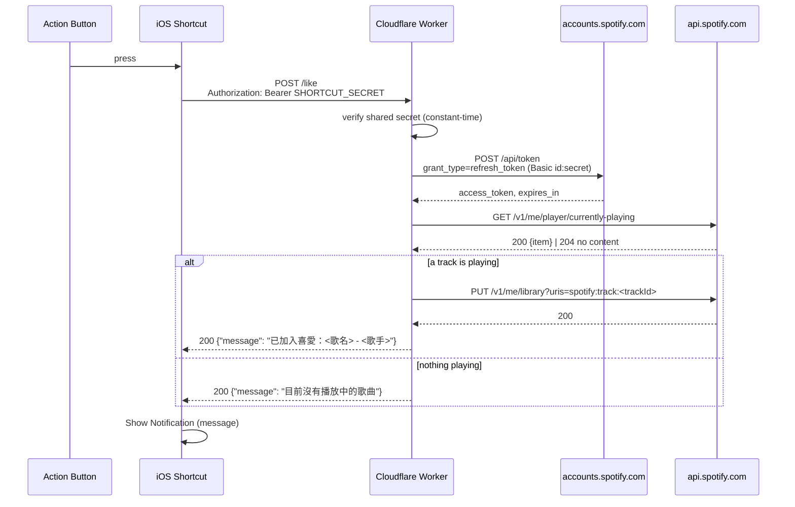

# Design Document

## Overview

A single Cloudflare Worker endpoint turns one Action Button press into one "save currently playing track to Liked Songs" operation on one personal Spotify account, and answers with a Traditional Chinese sentence short enough to read in a notification banner.

The Worker is stateless. Every invocation exchanges the stored refresh token for a fresh access token, reads the currently playing item, and issues an add-only `PUT` against the library using Spotify's current (non-deprecated) `/me/library` endpoint. There is no database, no session, no per-user record, and no queue. The only persisted state is three values in Cloudflare Worker Secrets plus one shared secret used to authenticate the Shortcut itself.

Two design constraints shape everything below:

1. **The caller is a notification, not a program.** The Shortcut displays whatever string it gets back. So the response is always valid JSON with a populated `message` field, and every failure mode — including Spotify outages and malformed responses — is mapped to a message rather than surfaced as an HTTP error the Shortcut would render as an opaque failure.
2. **The endpoint is a public URL with write access to a personal library.** `workers.dev` URLs are discoverable and a bare endpoint would let anyone spam writes to the account. The Worker therefore requires a bearer shared secret and performs zero Spotify calls before that check passes.

Implementation language is TypeScript on the `workerd` runtime, deployed with Wrangler.

## Architecture



### Trust and failure boundaries

| Boundary | Trusted? | Consequence for the design |
|---|---|---|
| Shortcut → Worker | Untrusted until the bearer check passes | Gate runs first; nothing about the request body or query influences which Spotify credentials are used |
| Worker → Spotify | Trusted endpoint, unreliable channel | Every call is wrapped with a timeout and a failure classifier; no response field is assumed present |
| Worker Secrets → Worker | Trusted | Read from `env` only; never echoed into responses or logs |

### Why stateless

An access token lives about an hour, and a press happens a handful of times a day. Caching a token in KV would add a storage binding, a write on most invocations, and a stale-token failure mode, to save roughly 150 ms on an interaction that is already asynchronous from the user's point of view. The design instead keeps a best-effort in-memory cache in module scope: if the isolate happens to be warm the token is reused, otherwise a fresh exchange runs. Correctness never depends on the cache, which is what makes the stale-token retry (below) sufficient.

## Components and Interfaces

```
src/
  index.ts        # fetch handler: routing, gate, orchestration, response shaping
  gate.ts         # shared-secret verification for the Shortcut caller
  spotify/
    token.ts      # refresh-token grant + in-isolate access token cache
    player.ts     # GET /v1/me/player/currently-playing → PlaybackState
    library.ts    # PUT /v1/me/library (add-only), GET /v1/me/library/contains
    http.ts       # fetch wrapper: timeout, status classification, no-throw result
  outcome.ts      # Outcome union + classification of failures into outcomes
  messages.ts     # the message catalog and the success formatter
  types.ts        # Env, PlaybackState, TrackInfo
scripts/
  get-refresh-token.ts  # one-time authorization-code helper (not deployed)
```

### `index.ts` — request handler

Responsibilities, in order: resolve the message language, route match, gate, orchestrate, shape response. It contains no Spotify knowledge beyond the call sequence, and it is the only module that constructs a `Response`.

```ts
export default {
  async fetch(request: Request, env: Env): Promise<Response> {
    const language = resolveLanguage(env);   // first, and cannot fail

    if (new URL(request.url).pathname !== "/like") return respond("not_found", language);
    if (request.method !== "POST") return respond("method_not_allowed", language);
    if (!isAuthorizedCaller(request, env)) return respond("unauthorized", language);

    const outcome = await likeCurrentTrack(env);
    return respond(outcome, language);
  },
} satisfies ExportedHandler<Env>;
```

The language is resolved before every other check, including the config check, because `respond` needs a language for *every* response — including the `misconfigured` one that an unrecognized `MESSAGE_LANGUAGE` itself produces. Resolving it later would leave that one response with nothing to render in. `resolveLanguage` cannot fail (it falls back to the default), so putting it first costs nothing; reporting a bad value stays `validateConfig`'s job. `respond` and `messageFor` take the language as a parameter, and it is deliberately not logged — the log line stays `{outcome, status}`.

The two routing messages (`not_found`, `method_not_allowed`) stay English-only and untranslated, and live outside the catalog. They are HTTP protocol reason phrases seen by whatever mis-addressed the Worker, not notification text seen by the user.

### `likeCurrentTrack` — the orchestration

```ts
async function likeCurrentTrack(env: Env): Promise<Outcome> {
  const token = await getAccessToken(env);          // Result<string, Failure>
  if (!token.ok) return classify(token.error);

  const playback = await getCurrentlyPlaying(token.value);
  if (!playback.ok) return classify(playback.error);

  const track = playback.value.track;               // TrackInfo | null
  if (track === null) return { kind: "nothing_playing" };
  if (track.id === null) return { kind: "not_addable" };  // local file / episode

  const saved = await saveTrack(token.value, trackUriFromId(track.id));
  if (!saved.ok) return classify(saved.error);

  return { kind: "added", track };
}
```

Every step returns a `Result` rather than throwing, so the orchestration has one exit shape and the classifier is the single place where a failure becomes a user-visible message. No step can fall through without producing an `Outcome`.

### `spotify/token.ts` — token exchange

```ts
const TOKEN_URL = "https://accounts.spotify.com/api/token";
const EXPIRY_MARGIN_MS = 60_000;

let cached: { token: string; expiresAt: number } | null = null;

export async function getAccessToken(env: Env): Promise<Result<string, Failure>> {
  if (cached && Date.now() < cached.expiresAt - EXPIRY_MARGIN_MS) {
    return ok(cached.token);
  }
  const basic = btoa(`${env.SPOTIFY_CLIENT_ID}:${env.SPOTIFY_CLIENT_SECRET}`);
  const res = await call(TOKEN_URL, {
    method: "POST",
    headers: {
      Authorization: `Basic ${basic}`,
      "Content-Type": "application/x-www-form-urlencoded",
    },
    body: new URLSearchParams({
      grant_type: "refresh_token",
      refresh_token: env.SPOTIFY_REFRESH_TOKEN,
    }),
  });
  if (!res.ok) return res;                       // 400/401 here means bad credentials
  const body = await readJson(res.value);
  if (typeof body?.access_token !== "string") return err({ kind: "malformed" });

  cached = {
    token: body.access_token,
    expiresAt: Date.now() + (body.expires_in ?? 3600) * 1000,
  };
  return ok(body.access_token);
}
```

Spotify returns `400 invalid_grant` — not `401` — when a refresh token has been revoked, so the classifier treats a failed *token exchange* as an authentication failure for any 4xx, while a failed *data call* uses the plain status classes. That distinction is the one place where the call site affects the mapping.

Refresh-token *expiry* (the 6-month lifetime described in the setup procedure) reaches the endpoint the same way revocation does: `400 invalid_grant`. So it lands on the existing `auth_failed` outcome and the existing "please re-authorize" message with nothing added, and the two causes need no distinguishing — the fix is the same authorization-code flow either way. The 4xx-means-auth rule for the exchange is what makes this work rather than luck: a `400` would otherwise be classified as a generic API failure and answered with "try again later", which is wrong advice for a grant that will never succeed again. A failed exchange also returns immediately rather than being retried, which is what Spotify's guidance for an expired token asks for: stop refreshing, discard the stored token, re-authorize.

**Stale-token retry.** If a data call returns `401` while using a cached token, the Worker invalidates the cache, re-exchanges once, and retries the call once. A second `401` is reported as an authentication failure. The retry is capped at one attempt so a genuinely revoked authorization cannot produce a loop, and it is the reason the in-memory cache cannot cause a user-visible error.

### `spotify/player.ts` — reading playback

The currently-playing endpoint has more shapes than its happy path suggests, and conflating them is the most likely source of a wrong notification. `getCurrentlyPlaying` normalizes all of them into `PlaybackState`:

| Spotify response | Normalized to |
|---|---|
| `204 No Content` (nothing active) | `{ track: null }` |
| `200` with empty body | `{ track: null }` |
| `200` with `item: null` | `{ track: null }` |
| `200`, `currently_playing_type` of `ad` / `unknown` | `{ track: null }` |
| `200`, `currently_playing_type: "episode"` | `{ track: { id: null, ... } }` |
| `200` track with `id: null` (local file) | `{ track: { id: null, ... } }` |
| `200` track with an id, `is_playing: false` (paused) | `{ track: {...} }` — paused still counts |

Paused counts as "currently playing" deliberately: the user's mental model is "the song on screen", and requiring `is_playing: true` would make the button fail exactly when someone pauses to reach for their phone.

### `spotify/library.ts` — add-only writes

`PUT /v1/me/tracks` and `GET /v1/me/tracks/contains` are deprecated. The module uses the current equivalents, `PUT /v1/me/library` and `GET /v1/me/library/contains`, both of which take a `uris` query parameter of comma-separated Spotify URIs (`spotify:track:<id>`, up to 40 per request) rather than bare ids.

```ts
export function saveTrack(token: string, trackUri: string) {
  return call(`https://api.spotify.com/v1/me/library?uris=${encodeURIComponent(trackUri)}`, {
    method: "PUT",
    headers: { Authorization: `Bearer ${token}` },
  });
}

export function trackUriFromId(trackId: string): string {
  return `spotify:track:${trackId}`;
}
```

The orchestrator builds the URI from the track id (`trackUriFromId`) and passes it to `saveTrack`, so the id-to-URI mapping lives in one place and every call site works in URIs rather than bare ids.

`PUT /v1/me/library` is already idempotent: adding a track that is present is a no-op returning `200`. This is what makes requirement 2 free rather than something needing a read-then-write. The module exports no `DELETE` path at all — the absence of a remove function is the enforcement mechanism for "add-only", checked by a test that scans the recorded request log.

The `user-library-read` scope backs an optional `isTrackSaved` probe (`GET /v1/me/library/contains?uris=<uri>`). It is not on the critical path: its result cannot change whether the add is issued, and a probe failure is swallowed. It exists so a future revision can distinguish "newly added" from "already liked" wording without a re-authorization, since scopes cannot be widened without redoing the authorization-code flow.

Using the current `/me/library` endpoints (rather than the deprecated `/me/tracks` endpoints) for both the save and the optional check satisfies requirements 3.4 and 3.5 directly — there is no fallback to the deprecated endpoints anywhere in the module.

### `spotify/http.ts` — the call wrapper

Every outbound request goes through one function that supplies a timeout and converts throws into values:

```ts
const TIMEOUT_MS = 6_000;

export async function call(url: string, init: RequestInit): Promise<Result<Response, Failure>> {
  try {
    const res = await fetch(url, { ...init, signal: AbortSignal.timeout(TIMEOUT_MS) });
    if (res.status === 401 || res.status === 403) return err({ kind: "auth", status: res.status });
    if (res.status >= 400) return err({ kind: "api", status: res.status });
    return ok(res);
  } catch (cause) {
    return err({ kind: "network", cause });   // DNS, TLS, reset, timeout/abort
  }
}
```

The 6 second timeout is chosen against the interaction, not the API: three sequential calls must finish well inside the Shortcut's patience, and a hung request is more usefully reported as "check your network" than left spinning.

## Data Models

```ts
type Language = "en" | "zh_TW";   // underscore, not BCP 47 `zh-TW`; see below

interface Env {
  SPOTIFY_CLIENT_ID: string;      // wrangler secret
  SPOTIFY_CLIENT_SECRET: string;  // wrangler secret
  SPOTIFY_REFRESH_TOKEN: string;  // wrangler secret
  SHORTCUT_SECRET: string;        // wrangler secret — authenticates the caller
  MESSAGE_LANGUAGE?: string;      // plain var, NOT a secret; optional, "en" | "zh_TW"
}

interface TrackInfo {
  id: string | null;   // null for local files and episodes: not addable
  name: string;
  artist: string;      // artists[0].name; see note below
}

interface PlaybackState {
  track: TrackInfo | null;
}

type Failure =
  | { kind: "auth"; status: number }
  | { kind: "api"; status: number }
  | { kind: "network"; cause: unknown }
  | { kind: "malformed" }
  | { kind: "config"; missing: string[]; invalid?: string[] };

type Outcome =
  | { kind: "added"; track: TrackInfo }
  | { kind: "nothing_playing" }
  | { kind: "not_addable" }
  | { kind: "auth_failed" }
  | { kind: "api_failed" }
  | { kind: "network_failed" }
  | { kind: "misconfigured" }
  | { kind: "unauthorized" }
  | { kind: "not_found" }
  | { kind: "method_not_allowed" };
```

`artist` uses the first artist only. A collaboration rendered as "A, B, C" pushes the track name out of a notification banner, and the first artist is what identifies the song when the user glances at it.

`MESSAGE_LANGUAGE` selects which language the notification text is rendered in. It is a plain var declared under `[vars]` in `wrangler.toml`, not a Worker Secret: it holds a wording choice rather than a credential, and routing it through `wrangler secret put` would hide a value the operator wants to read back. `Language` uses `zh_TW` with an underscore rather than the BCP 47 `zh-TW` because this is an environment-variable value, not a content-negotiation header, and underscores avoid quoting surprises in shell and TOML.

**The value is validated, not coerced.** `validateConfig` — which also checks that every required secret binding is present and non-empty — accepts `"en"` and `"zh_TW"` matched exactly, treats absent or empty as unset (meaning the default, `"en"`), and reports any other non-empty value by returning `err({ kind: "config", missing, invalid: ["MESSAGE_LANGUAGE"] })`, which `classify` maps to the existing `misconfigured` outcome. Matching is deliberately strict: no case folding, no `zh-TW` / `zh_tw` aliasing. The only way to produce an unrecognized value is to have tried to configure the language and misspelled it, so a silent fallback would answer every press in the wrong language with nothing to indicate why — a near miss is worth reporting rather than guessing at. Because config validation already runs before the orchestration, a bad value costs zero Spotify calls. The `invalid` field, like `missing`, records binding *names* only and never values: the `Failure` is constructed from an `Env` that also holds secrets, and keeping values out of it by construction is what stops one reaching a log line later.

## Endpoint Contract

### Request

```
POST https://<worker>.workers.dev/like
Authorization: Bearer <SHORTCUT_SECRET>
```

No body, no query parameters. Anything sent is ignored — there is nothing for the caller to parameterize, and accepting parameters would create a surface where a request could try to influence which account or credential is used.

`POST` rather than `GET` because the call mutates the library; it also means a URL pasted into a browser or scanned by a crawler cannot fire it.

### Response

Always `application/json`, with `message` as the field the Shortcut reads:

```json
{
  "message": "已加入喜愛：Bohemian Rhapsody - Queen",
  "ok": true,
  "outcome": "added",
  "track": { "name": "Bohemian Rhapsody", "artist": "Queen" }
}
```

```json
{ "message": "目前沒有播放中的歌曲", "ok": true, "outcome": "nothing_playing" }
```

```json
{ "message": "無法連線到 Spotify，請檢查網路連線", "ok": false, "outcome": "network_failed" }
```

`message` is present in every response including errors, so the Shortcut needs exactly one step to render any outcome. `ok` and `outcome` are for debugging and for a future Shortcut that wants to branch (e.g. different haptics on failure); the notification path never needs them.

### Status codes

Business outcomes return `200` even when they represent a Spotify failure. The Shortcuts `Get Contents of URL` action treats a non-2xx response as an action error, which aborts the Shortcut before `Show Notification` runs — a 502 would give the user a generic iOS failure dialog instead of "無法連線到 Spotify". Carrying the failure in the body is what makes the error messages reachable at all.

| Outcome | HTTP | Rationale |
|---|---|---|
| `added`, `nothing_playing`, `not_addable` | 200 | Normal outcomes |
| `auth_failed`, `api_failed`, `network_failed`, `misconfigured` | 200 | Must reach the notification; failure is carried in `ok`/`outcome` |
| `unauthorized` | 401 | Not the Shortcut; an unauthenticated prober should see a rejection, not a 200 |
| `not_found` | 404 | Wrong path |
| `method_not_allowed` | 405 | Wrong verb |

The trade-off: if the Shortcut's own secret is wrong, the user sees an iOS action error rather than a Chinese message. That is a setup-time mistake that surfaces on the first press and is worth an honest 401 rather than a soft 200 for every drive-by request. The setup procedure below calls out this specific symptom.

## Error Handling and Message Mapping

All user-facing strings live in one catalog module so the set is enumerable and testable.

**The catalog is per language.** `MESSAGES` is keyed first by `Language` and then by outcome kind, so the table's Message column is one string per language rather than one string; the column below shows the `zh_TW` rendering, and `en` carries the same set (`Nothing is playing`, `Spotify authorization expired, please re-authorize`, and so on). Alongside the catalog, `messages.ts` exports `DEFAULT_LANGUAGE` (`"en"`), `LANGUAGES` (derived from the catalog's own keys, so the list and the catalog cannot drift), `parseLanguage(raw)` (strict, returning `null` for anything that is not a catalog key — via an own-property check rather than `in`, so `toString`, `constructor`, and `__proto__` are not mistaken for languages), `resolveLanguage(env)` (never fails: absent, empty, or unrecognized all yield `DEFAULT_LANGUAGE`), and `messageCatalog(language)` for one language's strings. `MESSAGE_CATALOG` remains the flattened union across all languages, for membership assertions that do not care which language rendered. The success lead-in is per language too — `已加入喜愛：` for `zh_TW`, `Liked: ` for `en` — as is the rotation-failure suffix added by the token-rotation feature, and `formatAddedMessage` / `formatEpisodeAddedMessage` take `language` as a required second positional parameter, ahead of their existing optional `options`.

Language is threaded as an argument rather than held in module scope. A Worker isolate is reused across requests, so a module-level "current language" would be shared mutable state on the request path — one request's configuration could render another's message. Passing it keeps the whole catalog pure.

| Condition | Outcome | Message | Requirement |
|---|---|---|---|
| Track added (new or already liked) | `added` | `已加入喜愛：<歌名> - <歌手>` (歌手 truncated to 28 display columns; 歌名 in full) | 1.3, 2.2 |
| 204 / `item: null` / ad / unknown type | `nothing_playing` | `目前沒有播放中的歌曲` | 1.4 |
| Playing item has no track id (local file, podcast episode) | `not_addable` | `目前播放的內容無法加入喜愛` | 1.5 |
| Token exchange returns any 4xx (incl. `400 invalid_grant` from a revoked *or expired* refresh token) | `auth_failed` | `Spotify 授權已失效，請重新取得授權` | 4.2 |
| Data call returns 401 or 403 (after one retry) | `auth_failed` | `Spotify 授權已失效，請重新取得授權` | 4.2 |
| Any other Spotify status ≥ 400, including 429 and 5xx | `api_failed` | `操作未完成，請稍後再試` | 4.3 |
| Response body is not the expected shape | `api_failed` | `操作未完成，請稍後再試` | 4.3 |
| `fetch` throws: DNS, TLS, reset, timeout/abort | `network_failed` | `無法連線到 Spotify，請檢查網路連線` | 4.4 |
| A required secret binding is absent or empty | `misconfigured` | `伺服器設定不完整，請檢查 Worker 設定` | derived |
| `MESSAGE_LANGUAGE` is set to a non-empty value other than `en` or `zh_TW` | `misconfigured` | the same message, rendered in the default language | derived |
| Bearer secret missing or wrong | `unauthorized` | `未授權的請求` | derived (5.4, 5.5) |

**Derived cases.** Three rows, covering two outcomes, have no acceptance criterion directly behind them. `misconfigured` and `unauthorized` exist because the Worker must answer *something* for requirement 4.1's totality, and silently treating a missing binding as an auth failure would send the operator to re-authorize Spotify when the actual fix is `wrangler secret put`. The unrecognized-`MESSAGE_LANGUAGE` row is the same outcome reached from a different cause, and it reports in the default language because that is the only language the Worker can be sure it has. (`not_addable`, previously in this group, is now directly required by 1.5.)

**429 is not retried.** A rate limit from a single-user personal integration means something is wrong (a stuck automation, a repeated press), and sleeping inside the request would push the Shortcut past its timeout. "Try again later" is the honest answer.

**Logging.** Failures log the outcome kind and the HTTP status only. No token, secret, header, or request body is logged, because Workers logs are readable by anyone with dashboard access and a leaked refresh token is a full account compromise.

## Security Considerations

1. **The endpoint is authenticated.** A high-entropy shared secret (≥ 32 random bytes, base64url) is sent as `Authorization: Bearer` and compared against `env.SHORTCUT_SECRET`. Without it, anyone who learns the URL can write to the account's library at will.
2. **Comparison is constant-time.** The check compares byte arrays with a fixed-time routine rather than `===`, so response timing does not leak a prefix of the secret. It also compares lengths first and rejects a missing or malformed header before any other work.
3. **Fail closed, and fail before doing anything.** The gate runs before the token exchange, so an unauthorized request produces zero outbound Spotify calls and cannot be used to burn rate limit or probe whether the account is active.
4. **Credentials are never request-derived.** Client id, secret, and refresh token are read only from `env`. No code path lets a header, query parameter, or body field substitute a credential, which is what keeps the Worker bound to exactly one account (requirement 5.1). The bearer Shared_Secret check itself (requirements 5.4, 5.5) runs before any of this credential use, per point 3 above.
5. **Secrets never leave the Worker.** They are absent from responses, response headers, and logs. Error messages are drawn from the fixed catalog and never interpolate an upstream body, which is the usual way a token ends up echoed to a client.
6. **Secrets live only in Worker Secrets.** Set via `wrangler secret put`; never in `wrangler.toml`, source, or the repo. `.dev.vars` is used for local development and is git-ignored. CI greps the tree for credential-shaped literals.
7. **Rotation is a one-command operation.** `wrangler secret put` re-deploys the binding, so a suspected leak is remediated by rotating the shared secret (and updating the Shortcut) or by revoking the Spotify app's authorization and redoing the one-time flow.
8. **Minimal surface.** One path, one method, no CORS headers (the caller is not a browser, and omitting them stops browser-based cross-origin use), no request body parsing, and therefore no parser to attack.
9. **Scopes are minimal.** Exactly the four scopes the flow needs. Notably absent is any playback-control scope, so a compromised token cannot start, stop, or redirect playback.

## One-Time Setup Procedure

"One-time" holds for everything here except the authorization in step 2, which expires and has to be redone at least every 6 months (see step 4); registering the app, setting the secrets, and configuring the Shortcut are genuinely done once.

### 1. Register the Spotify application

1. Sign in at the Spotify Developer Dashboard with the account whose library the button should modify.
2. Create an app; note the **Client ID** and **Client Secret**.
3. Add `http://127.0.0.1:8787/callback` as a Redirect URI and save. It is used only by the local helper in step 2 and can be removed afterwards.

### 2. Obtain the initial refresh token (authorization-code flow)

Run `scripts/get-refresh-token.ts` locally, or perform the two requests by hand:

1. Open the authorize URL in a browser signed in as that account:

```
https://accounts.spotify.com/authorize
  ?client_id=<CLIENT_ID>
  &response_type=code
  &redirect_uri=http%3A%2F%2F127.0.0.1%3A8787%2Fcallback
  &scope=user-read-currently-playing%20user-read-playback-state%20user-library-modify%20user-library-read
```

2. Approve access. The browser lands on the redirect URI with `?code=<AUTH_CODE>`.
3. Exchange the code (within a few minutes — codes are short-lived and single-use):

```bash
curl -X POST https://accounts.spotify.com/api/token \
  -u "<CLIENT_ID>:<CLIENT_SECRET>" \
  -d grant_type=authorization_code \
  -d code=<AUTH_CODE> \
  -d redirect_uri=http://127.0.0.1:8787/callback
```

4. Save the `refresh_token` from the response. The `access_token` in the same response can be discarded — the Worker mints its own.

**The refresh token expires after 6 months.** Spotify announced this on 2026-06-18: refresh tokens issued to apps registered in the Developer Dashboard now have a 6-month lifetime, effective immediately for newly registered apps and from 2026-07-20 for existing ones. The clock starts when the account authorizes the app and is **not** reset or extended by refreshing — the Worker exchanging an access token every hour keeps itself running but does nothing for the underlying grant. Revoking the app's access or changing the account password still invalidates the token earlier than that. Re-authorizing (repeating this step) starts a fresh 6-month window, and previously granted scopes carry over as long as the same four are requested. Refresh tokens carry no issuance timestamp, so anticipating the expiry means recording the authorization date somewhere yourself.

The change applies to the user-authorized flows — Authorization Code, which this design uses, and Authorization Code with PKCE — and not to Client Credentials. Sources: `developer.spotify.com/blog/2026-06-18-refresh-token-expiration` and the *Refreshing tokens* tutorial at `developer.spotify.com/documentation/web-api/tutorials/refreshing-tokens`; both are rephrased rather than quoted here, for licensing compliance.

Scopes cannot be widened later without repeating this flow, which is why all four are requested now even though the library-read scope is only used by the optional probe.

### 3. Set the Worker secrets

```bash
wrangler secret put SPOTIFY_CLIENT_ID
wrangler secret put SPOTIFY_CLIENT_SECRET
wrangler secret put SPOTIFY_REFRESH_TOKEN
wrangler secret put SHORTCUT_SECRET      # openssl rand -base64 32
```

Then `wrangler deploy` and note the Worker URL. For local runs, put the same four keys in `.dev.vars` (git-ignored) and use `wrangler dev`.

**Re-authorizing after the 6-month expiry takes more than `wrangler secret put`.** The token-rotation feature makes the Worker prefer a rotated refresh token held in KV over the Secret: `readEffectiveRefreshToken` in `src/spotify/token.ts` reads `TOKEN_KV` key `refresh_token` first and falls back to `SPOTIFY_REFRESH_TOKEN` only when that read yields nothing or fails. A rotated token inherits the original authorization's 6-month lifetime rather than opening a new window, so when the authorization expires the KV value is expired too — and it still wins. Putting a freshly authorized token in the Secret therefore has no effect on its own: the stale KV entry keeps taking precedence and every press keeps answering `Spotify 授權已失效，請重新取得授權`. Recovery currently requires clearing the KV key as well:

```bash
wrangler kv key delete refresh_token --binding TOKEN_KV --remote
wrangler secret put SPOTIFY_REFRESH_TOKEN
```

This is a known operational trap of the current design rather than a solved problem. Nothing in the code detects that a stored rotated token is expired, and nothing prefers a newer Secret over an older KV value; the ordering that makes rotation work is the same ordering that makes recovery non-obvious. It is recorded here so the extra step is not rediscovered with the button already broken.

The notification language is optional and is *not* a secret. It goes in `wrangler.toml`:

```toml
[vars]
MESSAGE_LANGUAGE = "zh_TW"   # "en" (the default) or "zh_TW"
```

Omitting the var, or leaving it empty, gives English. Any other non-empty value makes every press answer `伺服器設定不完整，請檢查 Worker 設定` (in English, the default language) until it is corrected, rather than quietly answering in a language nobody asked for.

### 4. Configure the Shortcut

In the Shortcuts app, create a shortcut with two actions:

1. **Get Contents of URL**
   - URL: `https://<worker>.workers.dev/like`
   - Method: `POST`
   - Headers: `Authorization` = `Bearer <SHORTCUT_SECRET>`
   - Request Body: none
2. **Show Notification**
   - Body: `Get Dictionary Value` → key `message` from the previous step's result.

Then bind it: **Settings → Action Button → Shortcut**, and select this shortcut.

Verify by playing a song and pressing the button. Expected banner: `已加入喜愛：<歌名> - <歌手>`. If iOS shows a generic "the action failed" dialog instead of a Chinese message, the `Authorization` header is wrong — that is the one case where the Worker answers with a non-200 status.

## Correctness Properties

*A property is a characteristic or behavior that should hold true across all valid executions of a system — essentially, a formal statement about what the system should do. Properties serve as the bridge between human-readable specifications and machine-verifiable correctness guarantees.*

### Property 1: Token exchange uses the refresh-token grant with the stored credentials

*For any* client id, client secret, and refresh token held in the environment, the Worker's first outbound request is a `POST` to the Spotify token endpoint whose form body contains `grant_type=refresh_token` and that refresh token, and whose `Authorization` header is `Basic` with a base64 payload that decodes to exactly `<client id>:<client secret>`; the access token returned is the bearer credential on every subsequent Spotify call.

**Validates: Requirements 3.1**

### Property 2: A playing track always produces an add request for that track

*For any* currently-playing payload that contains a track with a non-null id, the Worker issues exactly one `PUT` to `/me/library` carrying that track's id as a `spotify:track:<id>` URI in the `uris` parameter, regardless of the payload's other fields (artist count, `is_playing`, extra or unknown fields).

**Validates: Requirements 1.1, 1.2, 3.4**

### Property 3: The success message is the template instantiated with the track's name and artist, with only the artist truncated to the attribution budget

*For any* track name and artist name, a successful add returns the message `已加入喜愛：<name> - <artist>` where the track name appears verbatim and only the artist is truncated to at most 28 display columns — an ellipsis (`…`) appended only when truncation actually occurred, and an artist that already fits passed through byte-for-byte — unchanged by JSON serialization, for all string content including CJK characters, emoji, surrounding whitespace, and names that themselves contain `" - "`.

**Amended:** this property originally asserted the message was the template instantiated with the raw name and artist. Truncation was added afterwards because iOS truncates a long notification banner *from the tail*. It applies only to the attribution field — the artist for a track, the show name for a podcast episode — and never to the title, so that what is lost to iOS's own truncation is the secondary field rather than the item the reader is trying to identify; an uncapped show name would otherwise consume the banner before the episode title started. The budget is measured in display columns rather than characters because CJK text is full-width: 28 columns is ~14 Han characters or ~28 Latin characters, giving both scripts the same visual length, where a fixed character count would leave Latin text with half the information. The constant is named `MAX_ATTRIBUTION_COLUMNS` to reflect that it governs the attribution field alone. The budget is 28 rather than a smaller number because it is sized against the notification banner, which fits roughly 38-40 columns per line over two lines: the lead-in (`已加入喜愛：` is 12 columns, `Liked: ` is 7), a 28-column attribution, and the ` - ` separator (3 columns) leave most of the second line for the title. One budget serves both languages, which is exactly what measuring in display columns buys — a character count would have needed a per-language number. Truncation applies only to the human-facing `message`; the structured `track` / `episode` fields in the response body keep their full untruncated values.

**Validates: Requirements 1.3, 2.2**

### Property 4: Every "no track" signal maps to the nothing-playing message and writes nothing

*For any* response in the no-track family — HTTP 204, an empty body, `item: null`, or a `currently_playing_type` of `ad` or `unknown` — the Worker returns exactly `目前沒有播放中的歌曲` and issues no request against `/me/library`.

**Validates: Requirements 1.4**

### Property 5: A not-addable current track is reported distinctly and writes nothing

*For any* currently-playing payload whose track has a null id (a podcast episode or a local file), the Worker returns exactly `目前播放的內容無法加入喜愛` and issues no request against `/me/library`.

**Validates: Requirements 1.5**

### Property 6: Liking is idempotent

*For any* initial library state and *any* number of consecutive invocations against the same playing track, the track is present in the library after every invocation and each invocation returns the same success message containing the track's name and artist.

**Validates: Requirements 2.1, 2.2**

### Property 7: The library never shrinks

*For any* sequence of invocations and *any* sequence of Spotify behaviors — successes, 4xx, 5xx, malformed bodies, thrown network errors — the Worker issues no `DELETE` against `/me/library`, and the modeled library set at the end of the sequence is a superset of the set at the start.

**Validates: Requirements 2.3**

### Property 8: Failure classification is total and matches the mapping table

*For any* failure injected at *any* of the three Spotify call sites — a status code drawn from 400–599, or a thrown error of any kind — the returned message is exactly the one the mapping table assigns to that failure class: the authentication message for the auth class, the generic message for every other status, and the connection message for every thrown error. No failure input yields a message outside those three.

**Validates: Requirements 4.2, 4.3, 4.4**

### Property 9: Every response carries a message from the catalog

*For any* request shape crossed with *any* Spotify behavior, including malformed JSON and unexpected exceptions, the response body parses as JSON and its `message` field is a non-empty string that is a member of the message catalog (or, for the success case, the success template instantiated).

**Validates: Requirements 4.1**

### Property 10: The account binding cannot be influenced by the caller, and unauthorized callers reach nothing

*For any* request carrying attacker-supplied credential-shaped material in headers, query parameters, or body, the credentials used in the token exchange are exactly those from the environment; and *for any* request whose bearer secret is absent, wrong, or malformed, the Worker makes zero outbound Spotify requests.

**Validates: Requirements 5.1, 5.4, 5.5**

### Property 11: Secrets never escape the Worker

*For any* outcome, no client id, client secret, refresh token, shared secret, or access token value appears as a substring of the response body, any response header, or any captured log output.

**Validates: Requirements 5.2**

### Property 12: The configured language selects the catalog, and an unrecognized one is reported rather than guessed

*For any* recognized `MESSAGE_LANGUAGE` value crossed with *any* Spotify behavior, every message the Worker returns on `/like` is a member of that language's catalog or that language's success template instantiated, and never a string from another language's catalog; and *for any* non-empty value that is not a recognized language, the Worker returns the `misconfigured` outcome rendered in the default language and issues zero outbound Spotify requests, regardless of how near a miss the value is (differing only in case, or using `zh-TW` rather than `zh_TW`). An absent or empty value behaves as the default language.

The two routing messages are outside the scope of this property: they are untranslated protocol reason phrases and belong to no catalog. The unrecognized-value half is a derived case in the same sense as the `misconfigured` row of the mapping table — no acceptance criterion names `MESSAGE_LANGUAGE` — so what is traced here is requirement 4.1's totality: whatever the configuration, the response still carries a message the Shortcut can display.

**Validates: Requirements 4.1**

## Testing Strategy

**Harness.** Vitest with `@cloudflare/vitest-pool-workers`, so tests exercise the real `fetch` handler in `workerd` rather than a mock of it. Outbound calls go through an injected fetch stub that records every request (method, URL, headers, body) and serves scripted responses — the recorded log is what Properties 2, 4, 5, 7, and 10 assert against.

**Property tests** use `fast-check`, minimum 100 runs each, and are tagged:

```
Feature: spotify-like-action-button, Property 6: Liking is idempotent
```

Property 6 and Property 7 are model-based: the fake Spotify keeps a `Set<string>` of saved ids (keyed by URI), `PUT /me/library` inserts, and the model asserts membership and monotonicity. Generators must include the edge cases identified during prework — CJK and emoji in names, a `" - "` inside a track name, local files with `id: null`, episodes, multi-artist tracks, and status codes across 400–599 including 429.

**Unit tests** stay few and cover what properties cannot: the four-scope constant in the authorize URL (3.3), that saves and checks both target `/me/library` rather than the deprecated `/me/tracks` endpoints (3.4, 3.5), the `GET /v1/me/library/contains` shape and the fact that a probe failure does not change the outcome (3.5), the stale-token retry issuing exactly one re-exchange and stopping after one retry, and the paused-track decision.

**Smoke tests** cover configuration, which has no input to vary: one test per missing or empty secret binding asserting the `misconfigured` message with no Spotify call (3.2), and a CI step grepping the tree for hardcoded credential literals and for a committed `.dev.vars` (5.3, and the static half of 5.2).

**Manual verification** closes the loop the harness cannot reach (6.4): after deploy, press the Action Button with a track playing, with playback stopped, and with a podcast playing, and confirm the three expected banners.
